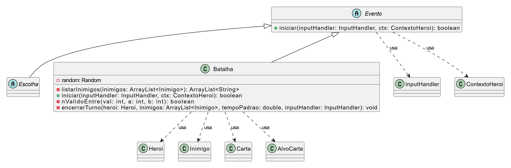

# Dragon Warrior

"Dragon Warrior" é um projeto em Java (Gradle) com batalhas de terminal na temática de Kung Fu Panda, organizado no módulo `app`.
A classe principal e `ProjetoPoo.App`.

# Estrutura

- Codigo principal: `app/src/main/java/ProjetoPoo`
- Testes: `app/src/test/java/ProjetoPoo`
- Build e relatorios: `app/build`

# Como executar

No bash (Git Bash/WSL):

``./gradlew :app:run --console=plain``

Observacao: o jogo e interativo e pede escolha de opcoes no terminal.

# Como rodar testes

No bash (Git Bash/WSL):

``./gradlew test``

# Cobertura de testes (JaCoCo)

Depois de rodar os testes, o relatorio HTML pode ser aberto em:

- `app/build/reports/jacoco/test/html/index.html`

O projeto tambem possui verificacao minima de cobertura no `check`.

# Build completo

``./gradlew clean check``

---

## Sistema de Progressão (Eventos e Mudança de Estado)

*Descrição do Sistema:*
O projeto implementa um sistema de progressão por meio de eventos que ocorrem entre as batalhas principais de modo aleatório. O jogador consegue passar por diferentes nós do mapa que alteram o seu estado enquanto player (como recuperação de vida ou aquisição de itens/recursos). 

Foram criados eventos como a `Fogueira` (um evento derivado de `Escolha` onde o herói pode descansar e aumentar sua vida) e o `Cassino` (um evento derivado de `Escolha` onde o jogador aposta recursos correndo riscos). Esses sistemas estão integrados à progressão do mapa que alteram o contexto do herói antes da próxima `Batalha`.

*Padrões e Estrutura Utilizados:*
O projeto usa polimorfismo com a classe base `Evento` e suas subclasses (`Batalha`, `Fogueira`, `Cassino`) para encapsular o comportamento de cada tipo de evento por meio do método comum `iniciar(inputHandler, ctx)`.

Para a criacao dos eventos, a classe `GerenciadorEventos` funciona como uma fabrica simples (Simple Factory), escolhendo e instanciando a classe concreta com base em `TipoEvento`.

*Fonte Consultada:*
* Simple Factory (referencia geral): [Refactoring Guru - Factory Method](https://refactoring.guru/design-patterns/factory-method)

